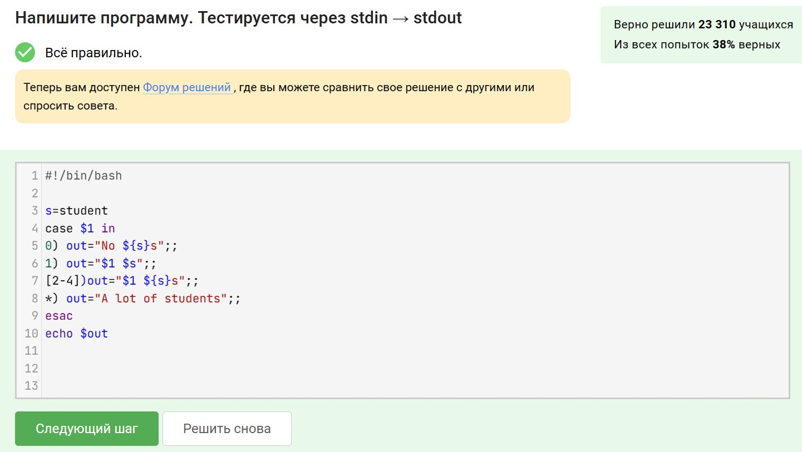
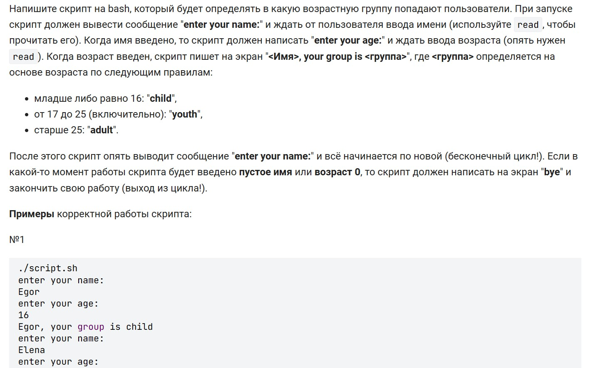
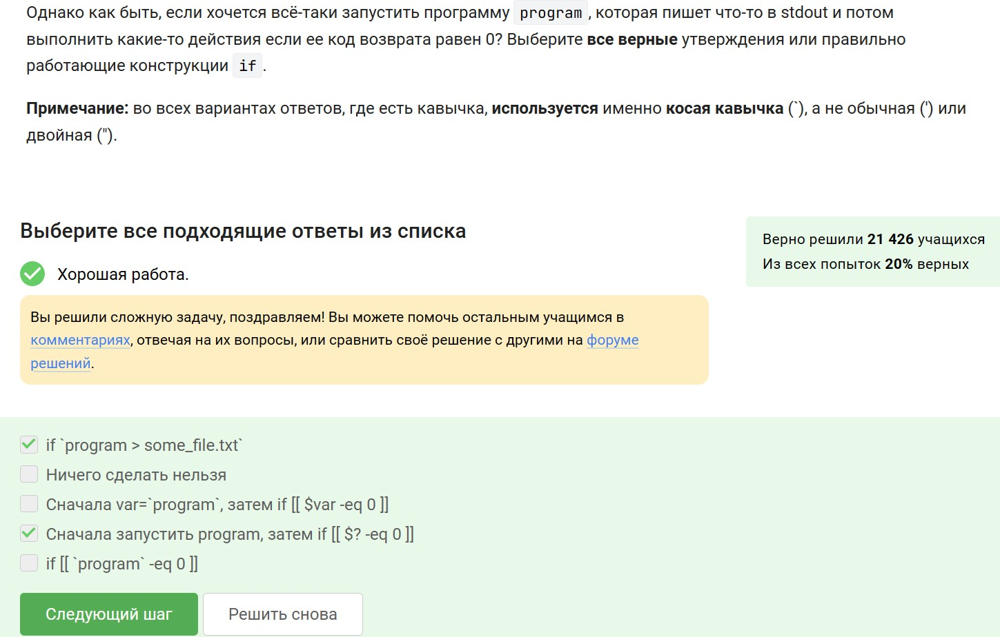
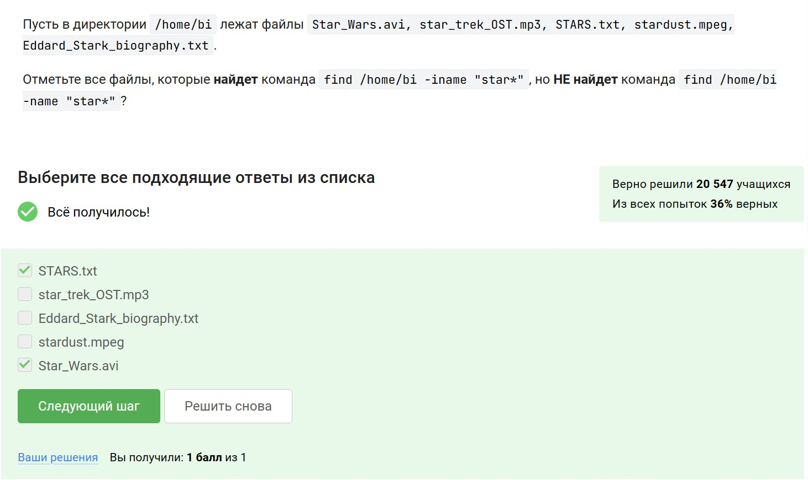

---
## Front matter
title: "Отчёт по разделу 3 внешнего курса"
subtitle: "Операционные системы"
author: "Арбатова Варвара Петровна"

## Generic otions
lang: ru-RU
toc-title: "Содержание"

## Bibliography
bibliography: bib/cite.bib
csl: pandoc/csl/gost-r-7-0-5-2008-numeric.csl

## Pdf output format
toc: true # Table of contents
toc-depth: 2
lof: true # List of figures
lot: true # List of tables
fontsize: 12pt
linestretch: 1.5
papersize: a4
documentclass: scrreprt
## I18n polyglossia
polyglossia-lang:
  name: russian
  options:
	- spelling=modern
	- babelshorthands=true
polyglossia-otherlangs:
  name: english
## I18n babel
babel-lang: russian
babel-otherlangs: english
## Fonts
mainfont: PT Serif
romanfont: PT Serif
sansfont: PT Sans
monofont: PT Mono
mainfontoptions: Ligatures=TeX
romanfontoptions: Ligatures=TeX
sansfontoptions: Ligatures=TeX,Scale=MatchLowercase
monofontoptions: Scale=MatchLowercase,Scale=0.9
## Biblatex
biblatex: true
biblio-style: "gost-numeric"
biblatexoptions:
  - parentracker=true
  - backend=biber
  - hyperref=auto
  - language=auto
  - autolang=other*
  - citestyle=gost-numeric
## Pandoc-crossref LaTeX customization
figureTitle: "Рис."
tableTitle: "Таблица"
listingTitle: "Листинг"
lofTitle: "Список иллюстраций"
lotTitle: "Список таблиц"
lolTitle: "Листинги"
## Misc options
indent: true
header-includes:
  - \usepackage{indentfirst}
  - \usepackage{float} # keep figures where there are in the text
  - \floatplacement{figure}{H} # keep figures where there are in the text
---

# Цель работы

Лучше ознакомиться с работой в виртульной машине, с операционной системой Linux

# Задание

Пройти сторонний курс

# Выполнение заданий

Чтобы выйти, нужно перейти в режим команд с помощью :, затем нажать команду выхода q

{#fig:001 width=70%}

Задание

{#fig:001 width=70%}

Здесь 9 слов, потому что считаются не только буквенные слова

{#fig:001 width=70%}

Это можно установить опытным путём

{#fig:001 width=70%}

: для перехода в режим набоора команд, s - команда, первое слово - то, что заменить, второе - то, чем заменить

{#fig:001 width=70%}

Это задание на работу приложения, всю информацию можно получить опытным путём или прочитать теорию

{#fig:001 width=70%}

Стрелочки перемещают только по действующей вкладке действующей оболочки

{#fig:001 width=70%}

Первая команда - переход в директорию, в которой создаётся файл

{#fig:001 width=70%}

@ нельзя использовать, с цифр имя начинаться не может

{#fig:001 width=70%}

Задание

{#fig:001 width=70%}

Записываю первый и второй аргументы в переменные, затем вывожу их

{#fig:001 width=70%}

Задание

{#fig:001 width=70%}

Нужно выбрать те, которые верны

{#fig:001 width=70%}

Задание

{#fig:001 width=70%}

И 3 и 5 попадают в раздел else, так как первое условие - 3>5 (5>5), что неверно, второе - 3<3 (5<3), что так же неверно, третье - 3=4 (5=4). Ничего из этого неверно.

{#fig:001 width=70%}

Задание

{#fig:001 width=70%}

Ввожу переменную, содержащую общую часть изменяемого слова, затем прохожусь по всем возможным случаям и составляю в результат, затем его вывожу

{#fig:001 width=70%}

Ключевое в этом задании, наверное, то, что запятые - тоже знаки

{#fig:001 width=70%}

Задание

{#fig:001 width=70%}

Ввожу флаг, прошу в цикле ввести имя, проверяю, если оно пустое - вывожу нужную фразу, меняю флаг, выхожу из цикла. Делаю то же с возрастом. Далее провожу все проверки

{#fig:001 width=70%}

Задание

{#fig:001 width=70%}

В первом случае а станет равной "значение а + значение b", а в последнем ничего, потому что нельзя ставить пробелы

{#fig:001 width=70%}

В таких кавычках пишется команда, которая будет исполнена, а так как до этого мы перешли в home/bi/, то команда pwd выведет это, так как она вводит текущее местоположение

{#fig:001 width=70%}

В выбранных мной вариантах правильная пунктуация и соблюдена логика, в остальных не так

{#fig:001 width=70%}

Задние

{#fig:001 width=70%}

Здесь можно решать вручную, это несложно, но долго, но я просто написала скрипт и проверила свои вычисления

{#fig:001 width=70%}

Задание

{#fig:001 width=70%}

Я запускаю цикл, который будет работать до первого break, считываю 2 значения. Проверяю, если они пустые, то прерываю цикл, иначе записываю условия задачи и вывожу то, что требуется

{#fig:001 width=70%}

Задание

{#fig:001 width=70%}

Создаю цикл, считываю 3 значения - первое число, операцию и второе число. Проверяю, захотел ли пользователь выйти, дальше проверяю, являются ли первое и второе число числами, а затем ужуе считаю резултат

{#fig:001 width=70%}

Второй найдет вторая команда, третий не найдёт первая, четвертый найдёт вторая

{#fig:001 width=70%}

Верно только первое, остальные ему противоречат

{#fig:001 width=70%}

Здесь фильтр по глубине поиска, поэтому стоит смотреть выше dir3 на 2 хода, то есть открывать папку и в ней открывать папку, но в этой уже не открывать папок

{#fig:001 width=70%}

Файл будет одинакового размера как раз из-за того, что в каждй строке есть искомое слово

{#fig:001 width=70%}

Я написала в файл эти предложения и вывела. Но вообще, предложения должны удовлетворять условию - первая буква x, k или l, не важно, заглавня или строчная, потом что-то, а затем с большой или маленькой буквы ubuntu

{#fig:001 width=70%}

Это то, за что отвечает эта опция

{#fig:001 width=70%}

Задание

{#fig:001 width=70%}

Указываю условия слова для замены - критерии аббревиатуры, заьем - на что заменить, а затем записываю в файл

{#fig:001 width=70%}

Это предназначение этой опции

{#fig:001 width=70%}

Я проверила это практически

{#fig:001 width=70%}

Задание

{#fig:001 width=70%}

Устанавливаю подписи, в кавычках пишу то, что должно быть написано буквами, далее то, что должно быть написано как значение переменных

{#fig:001 width=70%}

Задание

{#fig:001 width=70%}

Делаю отзеркаливание, дальше разворачиваю вращение и увеличиваю его скорость

{#fig:001 width=70%}

В первом варианте у первого не изменятся права, дальше можно не смотреть, а в четвертом варианте права станут полными для всех

{#fig:001 width=70%}

Задание 

{#fig:001 width=70%}

Первое не подходит, потому что это даёт возможность исполнения, а не записи, второе потому что мв добавляем только группе, четвёртое потому что мы не можем дать доступ к корневому каталогу не из корневого каталога

{#fig:001 width=70%}

Это функционал этой команды

{#fig:001 width=70%}

Сначала вывожу эту коману, потом опции для перевода

{#fig:001 width=70%}

Сокращаю команду до максимально короткой формы  

{#fig:001 width=70%}

# Выводы

Я ознакомиламсь с работой в виртульной машине, с операционной системой Linux

# Список литературы{.unnumbered}

::: {#refs}
:::
